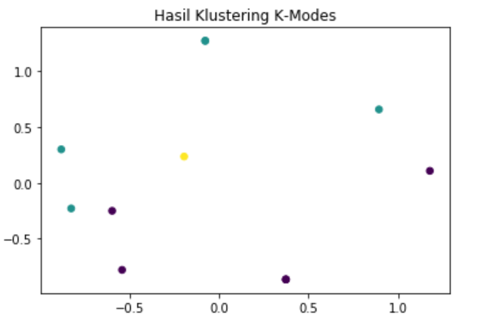

# **Implementasi Metode K-Modes dan K-Prototype dengan menggunakan bahasa pemrograman python**

### **Clustering**

<p style="text-align:justify;">Clustering adalah suatu metode untuk mengelompokkan data berdasarkan ukuran kemiripan data tersebut. Pada metode clustering pengelompokan datanya tidak harus sama, akan tetapi hanya kemiripan data tersebut yang didapatkan berdasarkan pada kedekatan suatu karakteristik sample yang, ada dengan menghitung jarak salah satunya dengan menggunakan rumus ecluidian distance. pada dasarnya, metode clustering mengoptimumkan pusat cluster(centroid) untuk melakukan pengelompokan.</p>
<p style="text-align:justify;">dalam hal ini metode clusting biasa digunakan dalam Segmentasi Pasar, pemetaan wilayah, Manajement marketing, dan lain-lain.</p>
<p style="text-align:justify;">Salah satu algoritma clustring yang banyak dipakai adalah K-Means clustering. Hal ini memungkinkan untuk mengelompokkan data sesuai dengan kesamaan yang ada di antara mereka dalam k cluster, diberikan sebagai input ke algoritma.</p>
<h5></h5>
##### K-Modes Clustering

<p style="text-align:justify;">K-Modes clustering adalah turunan dari metode K-Means clustering. Pada metode K-Means hanya bekerja pada data yang nilainya numeric dan tidak akan bekerja jika data yang akan cluster adalah nilainya kategorikal. K-Modes berkerja mirip seperti K-Means, akan tetapi metode ini di khususkan untuk mengelompokkan data yang nilainya adalah kategorikal.K-Modes berkerja dengan menggunakan metode berbasis frekuensi untuk memperbarui modus dalam proses pengelompokan dan mengkuantifikasi total ketidakcocokan antara dua objek. semakin kecil jumlah ini, semakin mirip kedua objek.</p>
##### K-Prototype Clustering

<p style="text-align:justify;">K-Prototype clustering merupakan metode clustring gabungan dari K-Means dan K-Modes. Metode ini digunakan untuk mengelompokkan data yang memiliki attribut Campuran. yaitu numeric dan categorical</p>
#### Implementasi  K-Modes dan K-Prototype menggunakan bahasa pemrograman python

##### K-Modes Clustering

<p style="text-align:justify;">untuk pengimplementasian K-Prototype kita menggunakan data yang dapat di download <a href="http://github.com/dkaslovsky/Coupled-Biased-Random-Walks">disini</a> Setelah di download kita load data tersebut ke dalam python dengan dalam bentuk data frame </p>
```python
import pandas as pd
data = pd.read_csv('CBRW_paper_example.csv',delimiter=',')
df = pd.DataFrame(data)
df.style.hide_index()

```

<p style="text-align:justify;"> Untuk Melihat gambar Silahkan <a href="http://https://github.com/MohHefni05/datamining/blob/master/assets/images/tugas3/1.png">Klik disini</a></p>

<p style="text-align:justify;">kita dapat menggunakan KModes yang merupakan library dari kmodes untuk melakukan clustering. data kategorikal dalam contoh ini digunakan k=3 untuk mengelompokkan menjadi 3 cluster. dari hasil proses clustering yang dilakukan, hasilnya dapat digabungkan dengan data yang telah ada dengan menambahkan attribut Cluster agar setiap baris data memiliki clusternya masing-msaing.


```python
from kmodes.kmodes import KModes

k = 3
df_dummy = pd.get_dummies(df)
data_set = df_dummy.reset_index().values

kmodes_cao = KModes(n_clusters=k, init='Cao', verbose=1)
cluster = kmodes_cao.fit(data_set)
data['Cluster'] = cluster.labels_

(data,k)

```

Output

```python
Init: initializing centroids
Init: initializing clusters
Starting iterations...
Run 1, iteration: 1/100, moves: 0, cost: 33.0
(    Gender Education  Marriage  Income Cheat?  Cluster
 0     male    master  divorced     low    yes        2
 1   female    master   married  medium     no        1
 2     male    master    single    high     no        0
 3     male  bachelor   married  medium     no        1
 4   female    master  divorced    high     no        0
 5     male       PhD   married    high     no        0
 6     male    master    single    high     no        0
 7   female       PhD    single  medium     no        1
 8     male       PhD   married  medium     no        1
 9     male  bachelor    single     low     no        0
 10  female       PhD   married  medium     no        1
 11    male    master    single     low     no        0,
 3)
```

<p style="text-align:justify;">Hasil dari clustering tersebut dapat kita visualisasikan dalam bentuk plot dengan menggunakan library matpotlib.

```python
import matplotlib.pyplot as plt
from sklearn.decomposition import PCA

pca = PCA(2)
plot_columns = pca.fit_transform(df_dummy.iloc[:,0:6])
plt.title("Hasil Klustering K-Modes")
plt.scatter(x=plot_columns[:,1], y=plot_columns[:,0], c=df_dummy["Cluster"], s=30)
plt.show()
```

<p style="text-align:justify;">Maka akan menampilkan plot scatter tersebut.</p>


##### <h5>K-Prototype Clustering</h5>

<p style="text-align:justify;">untuk pengimplementasian K-Prototype kita menggunakan data yang dapat di download <a href="http://data.bandung.go.id/dataset/jumlah-penduduk-berdasarkan-tingkat-pendidikan-menurut-kecamatan/resource/70d351e9-d4ca-418d-b0e1-dd3c44b4eee2">disini</a> Setelah di download kita load data tersebut ke dalam python dengan dalam bentuk data frame </p>
```python
import pandas as pd
data = pd.read_csv('data-jumlah-penduduk-berdasarkan-tingkat-pendidikan-berdasarkan-kelurahan-2016.csv',delimiter=',')
df = pd.DataFrame(data)
df.style.hide_index()

```


<p style="text-align:justify;">Kita dapat menggunakan Kprototype yang merupakan library dari kmodes untuk melakukan clustering data campuran dari numerik dan kategorikal. dalam contoh ini digunakan k=5 untuk mengelompokkan menjadi 5 cluster. dengan menggunakan source code dibawah ini :</p> 
```python
from kmodes.kprototypes import KPrototypes

k = 5
df_dummy = pd.get_dummies(df)
data_set = df_dummy.reset_index().values

kproto = KPrototypes(n_clusters=k, init='Cao', verbose=2)
cluster = kproto.fit(data_set, categorical=[0, 1, 2, 3, 5])
data['Cluster'] = cluster.labels_

(data,k)

```

Output

```
Init: initializing centroids
Init: initializing clusters
Starting iterations...
Run: 1, iteration: 1/100, moves: 16, ncost: 636479607.0364193
Run: 1, iteration: 2/100, moves: 7, ncost: 630212718.574795
Run: 1, iteration: 3/100, moves: 2, ncost: 628042397.5836812
Run: 1, iteration: 4/100, moves: 4, ncost: 623058585.3959843
Run: 1, iteration: 5/100, moves: 1, ncost: 622727799.4007367
Run: 1, iteration: 6/100, moves: 0, ncost: 622727799.4007367
Init: initializing centroids
Init: initializing clusters
Starting iterations...
Run: 2, iteration: 1/100, moves: 18, ncost: 823978517.8455426
Run: 2, iteration: 2/100, moves: 11, ncost: 798644599.8040055
Run: 2, iteration: 3/100, moves: 7, ncost: 780227899.9686792
Run: 2, iteration: 4/100, moves: 15, ncost: 733323569.2927341
Run: 2, iteration: 5/100, moves: 11, ncost: 708912804.4196088
Run: 2, iteration: 6/100, moves: 6, ncost: 697874467.3169609
Run: 2, iteration: 7/100, moves: 3, ncost: 694040289.0742761
Run: 2, iteration: 8/100, moves: 0, ncost: 694040289.0742761
Init: initializing centroids
Init: initializing clusters
Starting iterations...
Run: 3, iteration: 1/100, moves: 16, ncost: 904299319.6226357
Run: 3, iteration: 2/100, moves: 8, ncost: 883587133.7567929
Run: 3, iteration: 3/100, moves: 11, ncost: 821636326.472323
Run: 3, iteration: 4/100, moves: 21, ncost: 723545530.8438975
Run: 3, iteration: 5/100, moves: 8, ncost: 706740873.6699655
Run: 3, iteration: 6/100, moves: 5, ncost: 697874467.3169609
Run: 3, iteration: 7/100, moves: 3, ncost: 694040289.0742761
Run: 3, iteration: 8/100, moves: 0, ncost: 694040289.0742761
Init: initializing centroids
Init: initializing clusters
Starting iterations...
Run: 4, iteration: 1/100, moves: 23, ncost: 654803683.5107675
Run: 4, iteration: 2/100, moves: 7, ncost: 637589003.758549
Run: 4, iteration: 3/100, moves: 7, ncost: 630212718.574795
Run: 4, iteration: 4/100, moves: 2, ncost: 628042397.5836811
Run: 4, iteration: 5/100, moves: 4, ncost: 623058585.3959844
Run: 4, iteration: 6/100, moves: 1, ncost: 622727799.4007367
Run: 4, iteration: 7/100, moves: 0, ncost: 622727799.4007367
Init: initializing centroids
Init: initializing clusters
Init: initializing centroids
Init: initializing clusters
Starting iterations...
Run: 5, iteration: 1/100, moves: 50, ncost: 721491218.9969732
Run: 5, iteration: 2/100, moves: 16, ncost: 668126732.4372468
Run: 5, iteration: 3/100, moves: 10, ncost: 641349282.3096949
Run: 5, iteration: 4/100, moves: 7, ncost: 623283066.2318155
Run: 5, iteration: 5/100, moves: 1, ncost: 622841558.4738488
Run: 5, iteration: 6/100, moves: 0, ncost: 622841558.4738488
Init: initializing centroids
Init: initializing clusters
Starting iterations...
Run: 6, iteration: 1/100, moves: 17, ncost: 630478541.63358
Run: 6, iteration: 2/100, moves: 1, ncost: 630054776.2317188
Run: 6, iteration: 3/100, moves: 0, ncost: 630054776.2317188
Init: initializing centroids
Init: initializing clusters
Starting iterations...
Run: 7, iteration: 1/100, moves: 13, ncost: 710921054.1587718
Run: 7, iteration: 2/100, moves: 7, ncost: 697874467.3169608
Run: 7, iteration: 3/100, moves: 3, ncost: 694040289.0742761
Run: 7, iteration: 4/100, moves: 0, ncost: 694040289.0742761
Init: initializing centroids
Init: initializing clusters
Starting iterations...
Run: 8, iteration: 1/100, moves: 26, ncost: 1219610889.672209
Run: 8, iteration: 2/100, moves: 21, ncost: 1040901262.9659413
Run: 8, iteration: 3/100, moves: 24, ncost: 851122244.6033916
Run: 8, iteration: 4/100, moves: 13, ncost: 778672534.6107851
Run: 8, iteration: 5/100, moves: 4, ncost: 769751856.0158658
Run: 8, iteration: 6/100, moves: 13, ncost: 732854505.5140269
Run: 8, iteration: 7/100, moves: 7, ncost: 718407069.5545243
Run: 8, iteration: 8/100, moves: 14, ncost: 679827005.9510918
Run: 8, iteration: 9/100, moves: 7, ncost: 664873853.1596735
Run: 8, iteration: 10/100, moves: 6, ncost: 652359326.96503
Run: 8, iteration: 11/100, moves: 6, ncost: 635201334.0977274
Run: 8, iteration: 12/100, moves: 4, ncost: 630466187.7182717
Run: 8, iteration: 13/100, moves: 1, ncost: 630019659.6844094
Run: 8, iteration: 14/100, moves: 0, ncost: 630019659.6844094
Init: initializing centroids
Init: initializing clusters
Starting iterations...
Run: 9, iteration: 1/100, moves: 15, ncost: 636131660.8906584
Run: 9, iteration: 2/100, moves: 3, ncost: 631667113.8925309
Run: 9, iteration: 3/100, moves: 2, ncost: 630466187.7182717
Run: 9, iteration: 4/100, moves: 1, ncost: 630019659.6844094
Run: 9, iteration: 5/100, moves: 0, ncost: 630019659.6844094
Init: initializing centroids
Init: initializing clusters
Starting iterations...
Run: 10, iteration: 1/100, moves: 23, ncost: 630635605.3263967
Run: 10, iteration: 2/100, moves: 3, ncost: 627551490.8965133
Run: 10, iteration: 3/100, moves: 2, ncost: 625381169.9053993
Run: 10, iteration: 4/100, moves: 4, ncost: 620397357.7177026
Run: 10, iteration: 5/100, moves: 1, ncost: 620066571.7224548
Run: 10, iteration: 6/100, moves: 0, ncost: 620066571.7224548
Best run was number 10
(      Nama Kecamatan  Nama Kelurahan  Belum Sekolah  Belum/Tidak Tamat SD  \
 0              Andir         Maleber    3042.000000           2027.000000   
 1              Andir  Dungus Cariang    2905.000000           2034.000000   
 2              Andir         Ciroyom    3194.000000           2120.000000   
 3              Andir     Kebon Jeruk    1839.000000           1483.000000   
 4              Andir          Garuda    1531.000000           1067.000000   
 ..               ...             ...            ...                   ...   
 148      Ujungberung     Pasir Endah    2170.000000           1668.000000   
 149      Ujungberung      Pasir Jati    2582.000000           1884.000000   
 150      Ujungberung      Pasirwangi    2378.000000           1855.000000   
 151  Standar Deviasi             NaN    1150.875004            740.457369   
 152      Rata - Rata             NaN    2386.933775           1633.549669   
 
         Tamat SD          SMP          SMA  Diploma I & II  Diploma III  \
 0    2384.000000  3180.000000  7332.000000       92.000000   530.000000   
 1    2568.000000  3001.000000  6953.000000      109.000000   455.000000   
 2    2868.000000  3367.000000  6669.000000       62.000000   307.000000   
 3    1735.000000  2681.000000  5060.000000       63.000000   310.000000   
 4    1026.000000  1532.000000  3954.000000       52.000000   382.000000   
 ..           ...          ...          ...             ...          ...   
 148  1243.000000  2022.000000  4911.000000      228.000000   731.000000   
 149  2175.000000  2563.000000  4697.000000      158.000000   607.000000   
 150  2430.000000  2444.000000  4199.000000      173.000000   415.000000   
 151  1342.716860  1120.725414  2322.125213       88.681969   381.834679   
 152  2099.430464  2245.158940  5068.701987      141.490066   598.311258   
 
         Strata 1    Strata 2   Strata 3        Jumlah  Cluster  
 0    1481.000000   71.000000   5.000000  20144.000000        4  
 1    1257.000000   73.000000   6.000000  19361.000000        0  
 2     917.000000   39.000000   4.000000  19547.000000        0  
 3    1579.000000   70.000000   6.000000  14826.000000        0  
 4     992.000000   62.000000   3.000000  10601.000000        2  
 ..           ...         ...        ...           ...      ...  
 148  1997.000000  257.000000  39.000000  15266.000000        0  
 149   942.000000   74.000000  10.000000  15692.000000        0  
 150   738.000000   61.000000  12.000000  14705.000000        0  
 151   957.858218  154.789891  26.614292   7101.739078        1  
 152  1519.768212  160.589404  22.860927  15876.794700        0  
 
 [153 rows x 14 columns],
 5)
```


<p style="text-align:justify;">Hasil dari clustering tersebut dapat kita visualisasikan dalam bentuk plot dengan menggunakan library matpotlib.</p> 
```python
pca = PCA(2)
plot_columns = pca.fit_transform(df_dummy.iloc[:,1:])
plt.title("Hasil Klustering K-Prototype")
plt.scatter(x=plot_columns[:,1], y=plot_columns[:,0], c=df_dummy["Cluster"], s=30)
plt.show()
```

